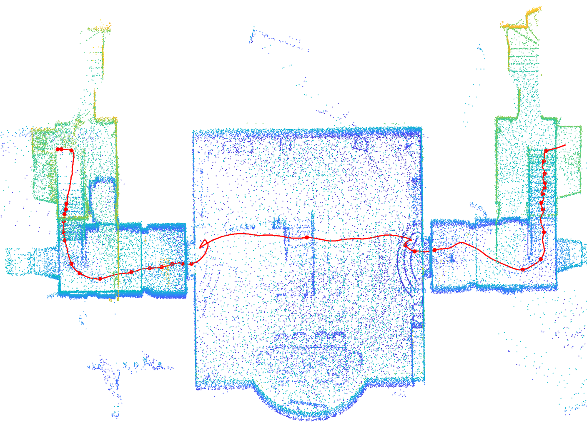
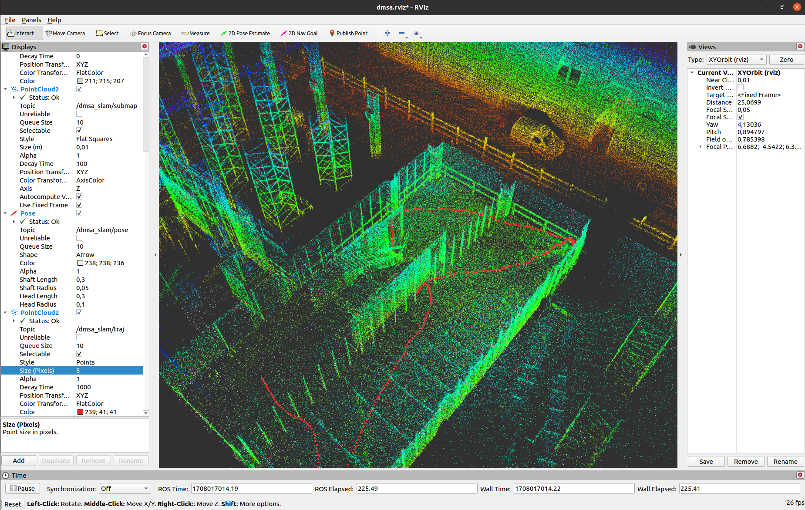

<meta name="google-site-verification" content="Fvl5zYA3_MD7qUU-3nCBgY5YwgHpMyd9bGJr0UeA0FI" />
# DMSA-SLAM
DMSA LiDAR SLAM is a robust and accurate package for LiDAR and IMU based mapping. First point clouds within a sliding time window are optimized conjointly with so called static points from the map and IMU measurements. When a new keyframe is added to the map, related keyframes are optimized. Keyframes are stored in a ring buffer, therefore old keyframes are deleted from a certain map size.
For point cloud alignment, **Dense Multi Scan Adjustment** (DMSA) is used. Details can be found in our [paper](https://arxiv.org/abs/2402.19044) (preprint, accepted for ICRA 2024).

**The use of IMU data is not mandatory, but recommended.**

<figure>

<figcaption>Fig.1 - Resulting keyframe point cloud of sequence exp14 Basement of the Hilti-Oxford Dataset. The estimated trajectory is marked with a red line.</figcaption>
</figure>

<figure>

    

<figcaption>Fig.2 - Running DMSA SLAM on the stairs sequence of the Newer College Dataset.</figcaption>
</figure>

# Contents

- [Preface](#preface) 

- [Prerequisites](#prerequisites) 

- [Sample Data](#sample-data) 

- [Installation](#installation)

- [Setup](#setup)

- [Run](#run)

- [Generate Dense Point Cloud](#generate-dense-point-cloud)

## Preface
The package is primarily designed as an offline mapping module and the default parameters are optimized towards robustness and accuracy. The processing speed is highly dependent on the hardware used and the data acquisition environment. Typical processing times are 2-3 times the recording time.

**Note:** In order to publish the software under the MIT license, a different type of interpolation was used to calculate the dense trajectory poses, in contrast to the published [paper](https://arxiv.org/abs/2402.19044). While [Cubic Hermitian spline interpolation](https://github.com/ttk592/spline) was used for the results published in the paper, in the published software [Barycentric Rational interpolation](https://live.boost.org/doc/libs/1_72_0/libs/math/doc/html/math_toolkit/barycentric.html) is used. This change and the continuous development of the software may lead to minor deviations in accuracy compared to the published results.

**Input:** Rosbag with LiDAR (PointCloud2-Messages) and IMU data

**Output:** Trajectory as Pose.txt file (TUM-format) and resulting keyframe point cloud as .pcd file

The package can work with LiDAR data from the following manufacturers (the ROS drivers must be configured in such a way that time stamp and ring id are provided for each point):
- Ouster
- Hesai
- Velodyne
- Robosense
- (Livox)

**Info for Livox-LiDARs:** The point clouds from Livox-LiDARs are at the moment not directly supported, but can be processed if the point clouds are recorded as PointCloud2-messages using the setting **sensor: "unknown"**. It is also recommended to change the following parameter in `config/slam_settings.yaml` to `max_num_points_per_scan: 1500` to obtain better results with sparse Livox point clouds.

**-> If someone can provide a rosbag (1-2 min, with motion) with Livox point clouds in the PointCloud2 PointXYZRTLT format (see [livox_ros_driver2](https://github.com/Livox-SDK/livox_ros_driver2)), then I will integrate a separate Livox configuration into the software.**

## Prerequisites
The package was developed with the following packages:

- Ubuntu 20.04
- ROS Noetic
- Eigen 3.4.0

Compatibility with other Ubuntu/ROS/Eigen versions should be possible, but has not been tested.

### 1. Install ROS Noetic
Instructions for installing ROS Noetic can be found [here](http://wiki.ros.org/noetic/Installation). 

### 2. Update Eigen to Eigen 3.4.0
Unfortunately, Eigen 3.4.0 is not available via apt package management on Ubuntu 20.04. You can download the latest Eigen version from [here](https://eigen.tuxfamily.org/index.php?title=Main_Page) and follow the instructions.

You can also use the provided shell script, that will update your Eigen version to 3.4.0 on Ubuntu 20.04:

`sh helpers/updateEigenUbuntu20.04.sh`

## Sample Data
Sequences from the Hilti 2022 Oxford Dataset and the Newer College Dataset were mainly used for the evaluations in the published paper.
For these datasets, configurations are provided as launch files in this package so that the sequences can be processed directly after adapting the Rosbag file paths. The sequences of the Hilti 2022 Oxford Dataset can be downloaded [here](https://hilti-challenge.com/dataset-2022.html) and those of the Newer College Dataset [here](https://ori-drs.github.io/newer-college-dataset/).

## Installation

### 1. Create workspace:
`mkdir catkin_ws`
### 2. Create source folder:
`cd catkin_ws && mkdir src && cd src`
### 3. Clone repository:
`git clone https://github.com/davidskdds/DMSA_LiDAR_SLAM.git`
### 4. Compile
`cd .. && catkin_make`

## Setup
The main SLAM settings are defined in `config/slam_settings.yaml` and should not have to be adjusted.

The following changes are made in `config/custom.yaml`, `config/hilti_2022.yaml`, `config/newer_college_ouster_64.yaml` or `config/newer_college_ouster_128.yaml`

### 1. Rosbag Directories (bag_dirs)
The software processes the data directly from the Rosbag, there is no need to run "`rosbag play ...`". The path to the Rosbag must be specified to process the data.

A Rosbag path could look like this:
`bag_dirs: "/home/user_name/recording.bag"`

Several Rosbags can also be processed directly one after the other. To do this, the rosbag names are separated by spaces:
`bag_dirs: "/home/username/recording1.bag /home/username/recording2.bag"`

**Attention:** The path to a Rosbag or the Rosbag file name must not contain a space character

### 2. Output Directory (result_dir)
By default, the software cyclically saves the current poses (as Poses.txt file) and the current keyframe point cloud (as PointCloud.pcd). The files are overwritten cyclically so that the latest data is always saved.
It is recommended to use home directory (or another folder within home directory) to prevent permission issues.
The parameter could be set like this:

`result_dir: "/home/USERNAME"`

### 3. LiDAR and IMU Settings (not necessary for benchmark dataset configurations like Hilti and Newer College)
Regarding the LiDAR the `sensor` type {"hesai","ouster","robosense","velodyne","unknown"} and the `lidar_topic` must be specified in the .yaml file.
For using an IMU the `imu_topic` and the extrinsics must be specified (see .yaml file). It is also possible to run DMSA-SLAM without IMU data. To do so, set `use_imu: false`.

## Run

### 1. Source Workspace:
`source devel/setup.bash`

### 2. Run Package:
`roslaunch dmsa_slam_ros hilti_2022.launch`

or

`roslaunch dmsa_slam_ros custom.launch`

After the package is started, RViz opens and displays the progress of the processing. In RViz the current pose (white), the processed submap point clouds, map points (grey) and the trajectory (red) are shown.

<figure>

<figcaption>Fig.3 - DMSA-SLAM in RViz.</figcaption>
</figure>

### Generate Dense Point Cloud
If the resulting keyframe point cloud is too sparse for your application, the package [dense_cloud_creator](https://github.com/davidskdds/dense_cloud_creator.git) can be used to generate a dense point cloud including all point clouds in the rosbag.
